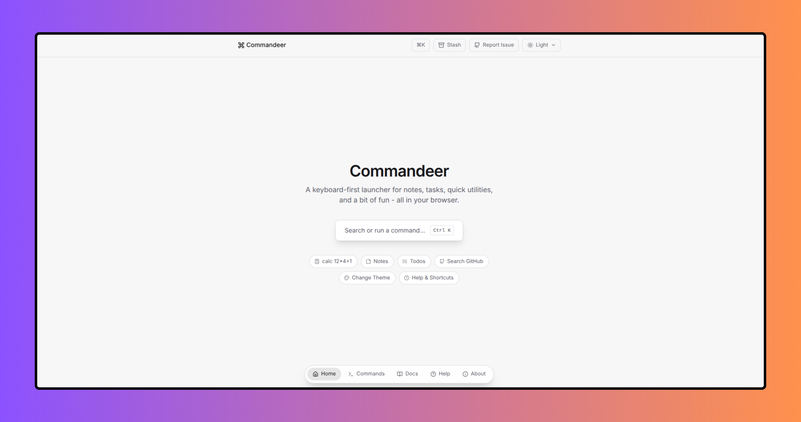

<p align="center">
  <a href="https://commandeer.vercel.app/">
    
  </a>
</p>

# Commandeer (⌘K web tool)

A keyboard-first command palette app - notes, todos, quick utilities, live
GitHub search, and a working theme switcher - built with React + TypeScript.

## Run it

```bash
npm install
npm run dev
```

Press **⌘K** (macOS) or **Ctrl+K** (Windows/Linux) anywhere in the app, or
click the search button, or click the `?` icon inside the palette for the
in-app help view.

## Pages

- `/` - landing page with the search trigger
- `/commands` - a browsable, searchable directory of every command
- `/docs` - how each feature works
- `/help` - keyboard shortcuts, inline syntax, and a short FAQ
- `/about` - what the project demonstrates and the stack it uses

Navigation between pages lives in a floating pill fixed to the bottom-center
of the screen, on every page, so the header can stay focused on the palette
trigger, your saved Notes/Todos (Stash), reporting an issue, and the theme
switcher.

Theme defaults to **Light** on first visit and applies at the document root,
so it's consistent across every page - not just inside the palette popup.
The header toggle and the palette's own "Change Theme" command read/write
the same value, and your choice is remembered for future visits.

## PWA

Commandeer is installable as a Progressive Web App:

- A `manifest.webmanifest` with a full icon set (16px-512px, plus maskable
  variants for Android's adaptive icons) so it looks right on any home
  screen or app switcher.
- A minimal service worker (`public/sw.js`) that caches the app shell for
  offline use and instant repeat loads. It's network-first for page
  navigations - a live deploy always wins over the cache when you're
  online - and falls back to the cached shell only when offline.
- iOS/Android home-screen metadata (`apple-mobile-web-app-*` tags, theme
  color) so "Add to Home Screen" behaves like a standalone app rather than
  opening a browser tab.

To regenerate the icon set from `public/icon.svg` after changing the mark,
any SVG-to-PNG tool works (the project used `sharp` one-off, not a runtime
dependency) - just re-export the same size list in `public/manifest.webmanifest`.

Note: this uses client-side routing (`react-router-dom`'s `BrowserRouter`).
If you deploy the built app as static files, configure your host to rewrite
all paths to `index.html` (Vercel/Netlify do this by default for SPAs; for
a plain static server you'd add a rewrite rule).

## Using it

| Action | How |
|---|---|
| Open / close the palette | `⌘K` / `Ctrl+K` |
| Move between results | `↑` / `↓` |
| Run the highlighted command | `Enter` |
| Go back one level | `Esc`, or `Backspace` on an empty input |
| Close entirely | `Esc` at the root level |

### Built-in commands

- **Notes** - quick-capture notes, saved to `localStorage`. Selecting a saved
  note copies it to your clipboard.
- **Todos** - a small task list. Completing the last open task fires a
  confetti burst.
- **Change Theme** - Dark / Light / System, persisted across reloads.
- **Search GitHub** - live, debounced repository search via the public
  GitHub API.
- **Utilities** (typed directly into the search box):
  - `calc 12*4+1` - evaluates the expression, copies the result
  - `base64 hello world` - encodes the text, copies the result
  - `color #6366f1` - previews a hex color, copies it
  - "Generate Password" / "Current Unix Timestamp" - one-shot commands
- **Help & Shortcuts** - the full shortcut and syntax reference, in-app.

Search vs. recents: with an empty input, your most recently used commands
are pinned to the top under "Recent" - but the full command list is always
shown right below it, so nothing is ever hidden behind recents. Start typing
to fuzzy-search across every registered command instead.

### Stash

A small popup, opened from the **Stash** button in the header, that lists
every saved Note and Todo in one place without going through the palette.
It reads and writes the exact same `localStorage` keys the Notes/Todos
palette commands use, so anything added via ⌘K shows up here instantly and
vice versa - there's only one source of truth for that data. From the Stash
popup you can copy or delete notes, and toggle or delete todos directly.

## Architecture

- `lib/types.ts` - `Command` and `PaletteView` contracts. Icons are
  [lucide-react](https://lucide.dev) components, not emoji.
- `commands/registry.ts` - central registry; feature modules call
  `registerCommand()` so commands can be added/removed independently of the
  Palette UI (the seam you'd use for a plugin system)
- `commands/notes.ts`, `commands/todos.ts` - small persisted sub-apps, each
  exporting a `PaletteView` for nested navigation
- `commands/theme.ts` - theme submenu wired to `lib/theme.ts`, which toggles
  CSS variables and respects `prefers-color-scheme`
- `commands/github.ts` - debounced async search; results are fed back into
  the Palette via local state since they can't be computed synchronously
  like the rest of the command set
- `commands/utilities.ts` - commands with a `preview()` function for live
  inline results (calculator, base64, color)
- `commands/help.ts` - the in-app documentation view
- `lib/search.ts` - fuzzy search via `fuse.js`
- `lib/store.ts` - Zustand store: open state, current input, view stack,
  recents (persisted), toasts. Opening/closing always resets input and the
  view stack in one place, so a reopened palette never shows stale state.
- `hooks/useHotkey.ts` - global ⌘K listener + arrow-key/Enter/Esc/Backspace
  navigation
- `components/Palette.tsx` - the palette shell
- `components/CommandItem.tsx` - a single result row
- `components/StashPanel.tsx` - the header popup listing saved Notes/Todos
- `components/BottomNav.tsx` - the floating page-navigation pill
- `lib/repo.ts` - single source of truth for the repo URL, used by the
  header's "Report Issue" link
- `components/Toaster.tsx` - transient toast notifications

## Extending it

Add a new command anywhere:

```ts
import { registerCommand } from './commands/registry'
import { Star } from 'lucide-react'

registerCommand({
  id: 'my-command',
  title: 'My Command',
  category: 'Custom',
  icon: Star,
  action: (ctx) => {
    ctx.toast('Ran it!')
    ctx.close()
  },
})
```

For a multi-step feature (like Notes or Todos), export a `PaletteView` and
`ctx.push(view)` into it from a root-level command.

## Ideas to extend further

- Command history / analytics
- Plugin system loaded from remote config
- Tauri wrapper for a real desktop app

## Deploy

Deployed on Vercel. Push to your repo and import it in the Vercel dashboard - no config needed, it's a standard Vite app.

If you enjoyed this project, consider giving it a ⭐ on GitHub. It helps others discover the project and motivates future improvements.

# License (MIT)

```text
MIT License

Copyright (c) 2026 Bilal Malik

Permission is hereby granted, free of charge, to any person obtaining a copy
of this software and associated documentation files (the "Software"), to deal
in the Software without restriction, including without limitation the rights
to use, copy, modify, merge, publish, distribute, sublicense, and/or sell
copies of the Software, and to permit persons to whom the Software is
furnished to do so, subject to the following conditions:

The above copyright notice and this permission notice shall be included in all
copies or substantial portions of the Software.

THE SOFTWARE IS PROVIDED "AS IS", WITHOUT WARRANTY OF ANY KIND, EXPRESS OR
IMPLIED, INCLUDING BUT NOT LIMITED TO THE WARRANTIES OF MERCHANTABILITY,
FITNESS FOR A PARTICULAR PURPOSE AND NONINFRINGEMENT. IN NO EVENT SHALL THE
AUTHORS OR COPYRIGHT HOLDERS BE LIABLE FOR ANY CLAIM, DAMAGES OR OTHER
LIABILITY, WHETHER IN AN ACTION OF CONTRACT, TORT OR OTHERWISE, ARISING FROM,
OUT OF OR IN CONNECTION WITH THE SOFTWARE OR THE USE OR OTHER DEALINGS IN THE
SOFTWARE.
```
© 2026 Commandeer. All rights reserved.
